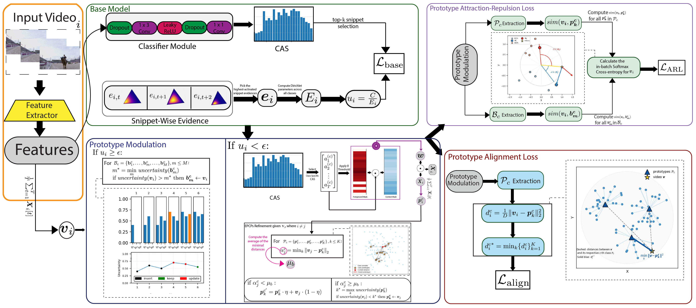

# Context-Based Prototype Learning for Weakly-Supervised Temporal Action Localization

Moayadeldin Hussain, Iker Gondra




## Requirements and Dependencies

- **GPU:** GeForce GTX 1080 Ti  
- **CUDA:** 11.8  
- **Python:** 3.9.23  
- **PyTorch:** 2.6.0+cu118  
- **NumPy:** 1.24.4  
- **Pandas:** 2.3.3  

Required packages are provided in `requirements.txt` which can be installed using:

```bash
pip3 install -r requirements.txt
```

## Data Preparation

We use the 2048-d features provided by MM 2021 paper: Cross-modal Consensus Network for Weakly Supervised Temporal Action Localization. You can get access of the dataset from [Google Drive](https://drive.google.com/file/d/1SFEsQNLsG8vgBbqx056L9fjA4TzVZQEu/view?usp=sharing).

## Testing

1. Download the pretrained model (47.6 Avg mAP on THUMOS'14 Benchmark) from [Google Drive](https://drive.google.com/file/d/1qZhmzcqIklnkRbgPrW1BBdUurdC17Rmi/view?usp=drive_link), and put it into "./download_ckpt/".

2. Run the following command:
```bash
python test.py --model_name CTXPL --dataset_name Thumos14reduced --path_dataset <C:\path_to_THUMOS14_dataset> --without_wandb
```

## Citation
If you find our work useful in your research, please star 💫 the repo and cite the paper as follows:

    @inproceedings{
    hussain2026ctxpl,
    title={Ctx{PL}: Context-based Prototype Learning for Weakly-Supervised Temporal Action Localization},
    author={Moayadeldin Hussain and Iker Gondra},
    booktitle={23rd Conference on Robots and Vision},
    year={2026},
    }

## License

See [MIT License](/LICENSE)

## Acknowledgement

This repo contains modified codes from:
 - [ECCV2022-DELU](https://github.com/MengyuanChen21/ECCV2022-DELU): for implementation of the baseline model [DELU](https://www.ecva.net/papers/eccv_2022/papers_ECCV/papers/136640190.pdf).

This repo uses the features and annotations from:
 - [MM2021-CO2-Net](https://github.com/harlanhong/MM2021-CO2-Net): [CO2-Net (MM2021)](https://arxiv.org/abs/2107.12589).
